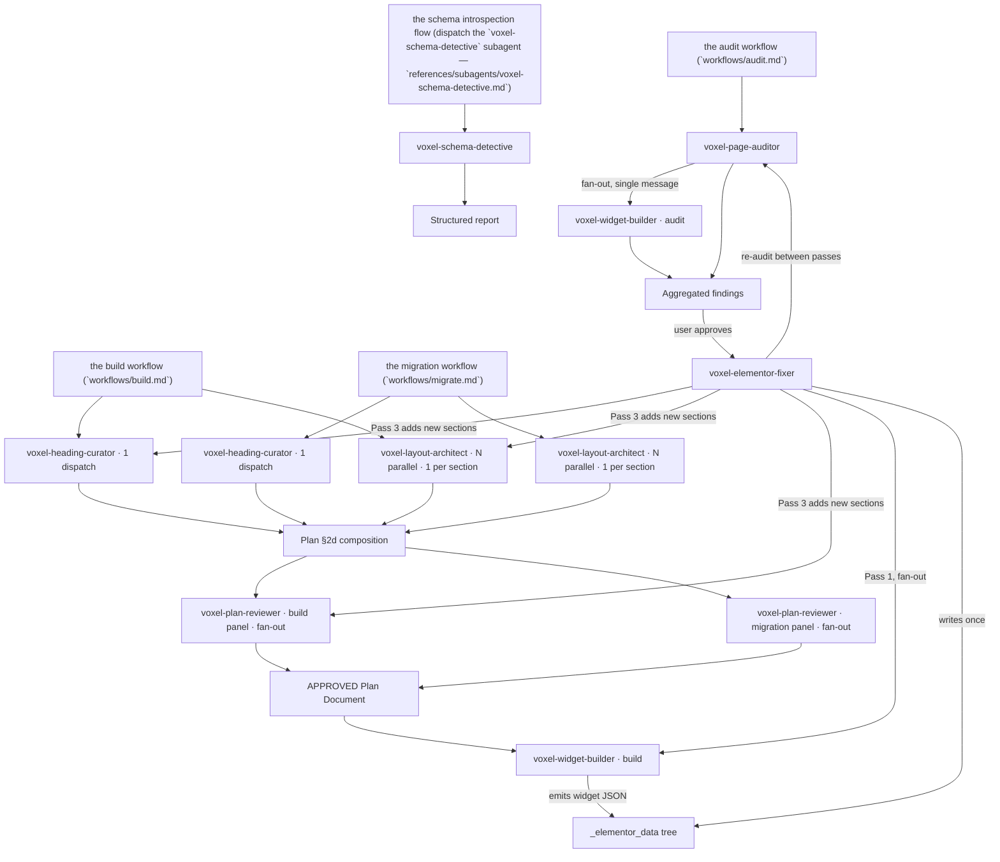

# Agents

The voxel-builder skill ships eight named subagents that formalize the parallel-atomic dispatch contract from [`../../references/core/parallel-dispatch.md`](../../references/core/parallel-dispatch.md) plus the Voxel entity-curation investigation contract used by the curation workflow ([`../../workflows/curation.md`](../../workflows/curation.md)). Each agent owns a slice of the audit / build / plan-review / fix / introspection / layout / heading-curation / entity-curation surface; the main agent is the orchestrator and dispatches these briefs by name rather than re-templating ad-hoc `general-purpose` agents.

## Dispatch graph

## Agent reference

### `voxel-page-auditor`

- **Role**: Top-down audit walk. Owns the `[G]` global tier itself; fans out per-section `voxel-page-auditor` instances (subtree-scoped — each audits one wrapper's `[S]` + its `[W]` widgets, no sibling re-walk) and per-widget `voxel-widget-builder` (audit mode) instances.
- **Mode**: Read-only. Never proposes patches.
- **Returns**: Structured findings — `{ tier, severity, class, scope, evidence, suggested_fix }` per item, plus a 1-paragraph summary.
- **Model**: sonnet.
- **When dispatched**: the audit workflow (`workflows/audit.md`), or any free-form prompt matching "audit page", "review template", "what's wrong with X", "find improvements", "is this using available data".

### `voxel-elementor-fixer`

- **Role**: Bottom-up fix loop with re-audit between passes. Pass 1 = widget mutations (parallel), Pass 2 = section mutations, Pass 3 = page-level mutations. Re-run the passes whenever the tree has materially changed; stop when it converges; surface the residual to the operator if it won't converge.
- **Mode**: Build. Dispatches `voxel-widget-builder` in build mode for Pass 1; calls `voxel-page-auditor` between passes. When Pass 3 adds new sections (not just mutates existing ones), enters the planning sub-pipeline: dispatches `voxel-heading-curator` (1×), `voxel-layout-architect` (N× parallel), and `voxel-plan-reviewer` (build panel, fan-out) scoped to the new section(s) only.
- **Returns**: Final assembled `_elementor_data` (written once via `wpdev elementor:import`), plus browser-screenshot verification report.
- **Model**: sonnet.
- **When dispatched**: After the user approves auditor findings — never auto-triggered. The orchestrator passes the auditor's findings as input.

### `voxel-widget-builder`

- **Role**: Single-widget specialist. Either constructs widget JSON (build mode) or audits a single widget (read-only mode). Atomic scope — one widget per dispatch.
- **Mode**: Binary — build or audit. Never both in one dispatch.
- **Returns**: Build mode → `{ widget_path, settings, elements: [...] }` for the orchestrator to insert. Audit mode → array of findings scoped to that widget.
- **Model**: sonnet.
- **When dispatched**: Fan-out from `voxel-page-auditor` (audit mode) or `voxel-elementor-fixer` Pass 1 (build mode), or directly from the build workflow (`workflows/build.md`) for parallel widget construction.

### `voxel-plan-reviewer`

- **Role**: Adversarial Plan Document reviewer — one named criterion per dispatch. Criterion = `coverage` | `density` | `hierarchy` | `data-wiring` | `pattern-reuse` | `relations` | `ssot-integrity` | `migration-preservation`. Atomic scope = one criterion, one report.
- **Mode**: Read-only — tool list excludes `Write` to enforce the contract. Never proposes a patch; never edits the Plan Document.
- **Returns**: `{ criterion, findings: [{ finding_id, severity, evidence, suggested_fix }], commands_run, summary }`. The orchestrator merges across criteria and writes the reconciliation under each finding.
- **Model**: sonnet.
- **When dispatched**: Phase 2e of the build workflow (`workflows/build.md`) or the migration workflow (`workflows/migrate.md`). Dispatch the relevant adversarial reviewers, one concern each, in parallel. Default to the full panel (`coverage`, `density`, `hierarchy`, `data-wiring`, `pattern-reuse`, `relations`, `ssot-integrity`, plus `migration-preservation` when migrating); narrow it only with a stated reason. All criteria fan out in a single message. Also dispatched from `voxel-elementor-fixer` when an audit-driven fix adds or restructures sections (not when it only mutates props).
- **Why one agent for the criterion panel**: tool list, model, return shape, and atomic-scope guarantees are identical across criteria; only the prompt's per-criterion protocol differs. One file × N dispatch is simpler than N agent files × 1 dispatch each and gives the same isolation (each subagent's context contains one criterion's brief).

### `voxel-layout-architect`

- **Role**: Per-section Layout map composer. Reads §2c archetype assignment + §2a field bindings + §2b widget catalog for ONE section and returns the complete Layout map block (Section wrapper props + Grid tracks responsive table + Widget placement table) ready for the orchestrator to splice into §2d.
- **Mode**: Build. Atomic scope — one section per dispatch. Tool list excludes `Write`; the orchestrator owns the Plan Document.
- **Returns**: `{ section_id, archetype, layout_map_markdown, escalate_split, commands_run, rationale }`. `escalate_split: true` signals the orchestrator to split the section at §2c and re-dispatch.
- **Model**: sonnet.
- **When dispatched**: Phase 2c→2d transition of the build workflow (`workflows/build.md`) and the migration workflow (`workflows/migrate.md`). One per §2c-selected section, all dispatched in a single message in parallel with the heading curator. Also dispatched from `voxel-elementor-fixer` when an audit-driven fix adds sections.

### `voxel-heading-curator`

- **Role**: Production heading-phrasing extractor. Samples a representative set of peer single templates on the same `<site>` (one is never enough), parses their EF V4 atomic widget heading rows, and returns a phrasing palette per archetype the orchestrator pulls from to compose §2d Blueprint heading text.
- **Mode**: Read-only — tool list excludes `Write`. Never proposes a Blueprint or edits the Plan Document.
- **Returns**: `{ peers_sampled, extracted_phrasings, palette_per_archetype, bare_title_warnings, anti_stuffing_audit, commands_run, summary }`.
- **Model**: sonnet.
- **When dispatched**: Phase 2c→2d transition. ONE dispatch per plan (not per section — pattern extraction reads the whole peer template, splitting per-section would multiply cost).

### `voxel-schema-detective`

- **Role**: Read-only introspection leaf. Reads the committed SSOT (`cli/src/generated/widget-schemas.json`, `cli/src/generated/ef-catalogs.json`) first; falls back to live `wpdev elementor:schema` / `elementor:dump` / `voxel:fields` / `voxel:data` / `voxel:status` / `voxel:templates` only when the SSOT can't answer (`ts-*` widgets, CPT fields, EF version mismatch suspected).
- **Mode**: Read-only — tool list excludes `Write`-class operations to enforce the contract.
- **Returns**: `{ command_run, raw_output, parsed: {...} }`. Verbatim CLI output (or SSOT JSON excerpt) for greppability + parsed convenience layer.
- **Model**: haiku (rote introspection, no architectural reasoning needed).
- **When dispatched**: the schema introspection flow (dispatch the `voxel-schema-detective` subagent — `references/subagents/voxel-schema-detective.md`), or any free-form prompt matching "what's the schema of X", "what props does Y take", "dump real widget JSON".

### `voxel-curator-agent`

- **Role**: Read-only investigation leaf for the curation workflow. Inspects one CPT, taxonomy, profile, user, merge candidate, or delete target through `wpdev voxel:*` evidence before the orchestrator mutates anything.
- **Mode**: Read-only. Never runs `voxel:create`, `voxel:set-field`, `voxel:delete`, author swaps, cache repair, or browser writes.
- **Returns**: `{ entity, commands_run, field_map, invariants, inbound_refs, risks, recommended_next_step }` with raw command excerpts when needed.
- **Model**: inherit.
- **When dispatched**: curation requests that need entity discovery, profile/user invariant checks, merge/delete inbound-reference scans, or repair/audit evidence. One entity per dispatch.

## Shared anti-patterns (enforced in every agent's prompt)

- **No synthesis from `define_props_schema()`.** For EF V4 atomic widgets (`ef-*`) read the committed SSOT (`cli/src/generated/widget-schemas.json`) first; live `wpdev elementor:schema` is the fallback. For `ts-*` Voxel theme widgets there is no SSOT — use `wpdev elementor:dump` on a real production post or one of the golden fixtures under [`examples/`](../../examples). Schema introspection answers "what props exist"; dump answers "what shape do values take in the wild".
- **No cross-scope findings.** A widget agent's return is one widget's findings. A section agent's return is one section's findings. Cross-scope observations get dropped or escalated to the orchestrator — never bundled.
- **No mode mixing.** Build OR read-only. A read-only agent that proposes a patch has violated mode and the orchestrator rejects its return.
- **No memorized widget shapes.** The EF V4 atomic schema churns between releases. Re-introspect on every build, even if the same widget was used in a prior session.

## Why eight agents and not one

A single "voxel-do-everything" agent would have to load every reference file every dispatch. Eight narrow agents keep each prompt under ~120 lines, which means each fan-out parallel dispatch starts faster and uses less context. The split also lets each agent's `tools` list be scoped precisely — `voxel-page-auditor`, `voxel-schema-detective`, `voxel-plan-reviewer`, `voxel-heading-curator`, `voxel-layout-architect`, and `voxel-curator-agent` literally cannot write to disk because their tool lists exclude `Write` (the auditor keeps `Task` only to fan out read-only subagents). Only the two build agents — `voxel-elementor-fixer` and `voxel-widget-builder` — carry `Write`. Mode discipline is encoded in the tool list, not just in the prompt.

## Role table

This skill delegates focused work to eight **subagent briefs** — self-contained prompt/scope contracts under [`references/subagents/`](./). Default to dispatching the matching brief. When the host agent does not support subagents, read the brief and perform exactly that atomic scope inline as a degraded fallback, recording `subagent-runtime-unavailable`. Either way, **use the brief's scope contract** — never improvise a generic agent for these jobs and never collapse multiple leaf scopes into one catch-all pass.

| Brief | Role | Mode |
|---|---|---|
| [`voxel-page-auditor`](./voxel-page-auditor.md) | Top-down audit walk (page → section → widget); aggregates findings | Read-only |
| [`voxel-elementor-fixer`](./voxel-elementor-fixer.md) | Bottom-up fix loop (widget → section → page) with re-audit between passes | Build |
| [`voxel-widget-builder`](./voxel-widget-builder.md) | Atomic widget JSON construction OR widget-tier read-only audit | Either |
| [`voxel-schema-detective`](./voxel-schema-detective.md) | Live EF / Voxel introspection (schema, dump, fields, data) | Read-only |
| [`voxel-plan-reviewer`](./voxel-plan-reviewer.md) | Adversarial Plan Document review — one criterion per dispatch from the full panel (coverage, density, hierarchy, data-wiring, pattern-reuse, relations, ssot-integrity, migration-preservation) | Read-only |
| [`voxel-layout-architect`](./voxel-layout-architect.md) | Per-section Layout map composer — produces wrapper props + responsive grid + per-widget placement. One per §2c-assigned section, parallel fan-out at §2c→§2d. | Build |
| [`voxel-heading-curator`](./voxel-heading-curator.md) | Production heading-phrasing extractor — samples peer templates, returns a contextual-dynamic-tag palette the orchestrator uses to fill Blueprint heading text. One per plan at §2c→§2d. | Read-only |
| [`voxel-curator-agent`](./voxel-curator-agent.md) | Read-mostly Voxel entity investigator — field snapshots, inbound relation scans, profile/user invariants, and merge/delete evidence. Dispatched from the curation workflow (`workflows/curation.md` §Phase 1) for broad audits. | Read-only |

This table complements the dispatch graph above.
