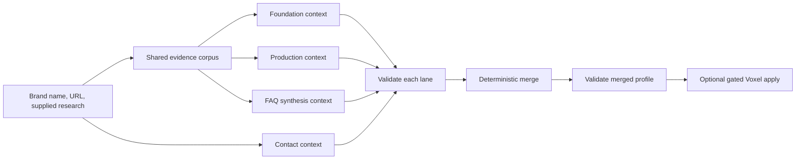

# Organization Profile Workflow

Research, author, validate, and optionally apply one complete best-matcha.com
Organization profile to the Voxel `brand` CPT. "Organization" names the editorial
workflow; it is not the target CPT key. This is the sole owner of the coordinated Foundation,
Production, Contact, and FAQ profile. It preserves four independent contexts while
reusing Voxel Builder's canonical content, FAQ, curation, rollback, and read-back
mechanics.

## When to Use

- Create, complete, refresh, or audit a matcha brand Organization profile.
- The requested fields include identity/SEO, history, products/production,
  verified contacts/location, and brand-exclusive FAQ.
- A supplied best-matcha.com research corpus must drive a deterministic profile.

## When NOT to Use

- A generic single-field content task with no coordinated brand profile: use
  [`content-generation.md`](content-generation.md).
- FAQ-only work: use [`faq-authoring.md`](faq-authoring.md).
- A record-only mutation with already-approved values: use
  [`curation.md`](curation.md).

## Required References and Contracts

Load these files only after this route is selected:

- [`../references/organization/prompts/global-system.md`](../references/organization/prompts/global-system.md)
- [`foundation.md`](../references/organization/prompts/lanes/foundation.md),
  [`production.md`](../references/organization/prompts/lanes/production.md),
  [`contact.md`](../references/organization/prompts/lanes/contact.md), and
  [`faq.md`](../references/organization/prompts/lanes/faq.md) lane prompts
- Matching JSON schemas under
  [`../references/organization/schemas/`](../references/organization/schemas/)
- [`content-generation.md`](content-generation.md) for field ownership, accepted
  Voxel write commands, rollback, apply, purge, and runtime verification
- [`faq-authoring.md`](faq-authoring.md) for reader-facing FAQ quality gates
- [`curation.md`](curation.md) for sanctioned record mutation when applying

The prompt files preserve the supplied best-matcha.com/n8n task contracts. The JSON
schemas are authoritative for output shape and bounds when prose and schema differ.

## Lane Graph



## Phase 0 - Resolve Record, Fields, and Baseline

**Entry:** Brand name and official brand URL are known. Site and Brand record
ID are known when a WordPress apply is requested.

1. Record `brand_name`, `brand_url`, target language, supplied `research`, site,
   the fixed CPT key `brand`, record ID, and whether the requested outcome is JSON-only
   or apply-and-verify. Ask only for a missing required brand name or URL.
2. Parse the supplied research completely before any external action. Preserve its
   citations, footnotes, exact product names, prices, sizes, dates, Japanese terms,
   and source URLs in a shared evidence corpus.
3. If applying, run `wpdev voxel:fields <site> brand` and
   `wpdev voxel:data <site> --id=<id>` as in
   `content-generation.md` to resolve the actual field keys/types and capture a
   rollback baseline. Refuse a record whose returned `type` is not `brand`.
4. Freeze this persistence map. The three logical core keys are authoring names,
   not invented Voxel or Lean SEO fields:

   | Logical output | Authoritative owner | Stored shape |
   |---|---|---|
   | `title` | WordPress `post_title` (Voxel `title` alias) | string |
   | `url_slug` | WordPress `post_name` | string |
   | `metadescription` | WordPress `post_excerpt` | string |
   | `tagline` | Voxel `tagline` | string |
   | `history-content` | Voxel `history-content` | HTML string |
   | `history-events` | Voxel `history-events` | rows of `event-date`, `event-name`, `event-description` |
   | `matcha-content` | Voxel `matcha-content` | HTML string |
   | `harvest-location` | Voxel `harvest-location` | HTML string |
   | `contact` | Voxel `contact` | rows of `canal-type` (one taxonomy slug in an array) and `canal-value` |
   | `location` | Voxel `location` | `address`, `map_picker`, `latitude`, `longitude` object |
   | `faq` | Voxel `faq` | rows of `question` and `answer` |

   `brand_url`/legacy `website` is input provenance. Do not add it to the final
   profile and do not persist it unless a separately requested, live-schema-backed
   field owns it. Stop on a missing or ambiguous owner rather than writing raw post
   meta or SQL.

**Exit:** One shared evidence corpus exists; output/apply mode is explicit; every
requested live field has a resolved owner and rollback baseline.

## Phase 1 - Freeze Four Independent Lane Packets

**Entry:** Phase 0 corpus and field map exist.

1. Load the global prompt, all four lane prompts, and their four matching schemas.
2. Create separate immutable packets for Foundation, Production, Contact, and FAQ.
   Each packet receives only its prompt inputs, the global contract, its schema,
   and an evidence ledger. Do not combine lane instructions into one model context.
3. Enforce strict field ownership:

   | Lane | Exclusive output fields |
   |---|---|
   | Foundation | `title`, `url_slug`, `metadescription`, `tagline`, `history-content`, `history-events` |
   | Production | `title`, `matcha-content`, `harvest-location` |
   | Contact | `title`, `contact`, `location` |
   | FAQ | `title`, `faq` |

4. Establish one shared external-action budget when research is supplied: at most
   two page reads/searches across Foundation, Production, and Contact combined.
   Foundation and Production use supplied research first, then the official site,
   then precise search for a critical gap. Contact prioritizes the official contact
   page, homepage footer, then an exact address search within the remaining budget.
   FAQ gets no browser/search tools and performs synthesis only.
5. Preserve source URLs in each lane's working evidence ledger. They need not be
   added to the published JSON schema.

**Exit:** Four non-overlapping packets and one auditable external-action budget are
ready; FAQ is explicitly tool-restricted to supplied corpus synthesis.

## Phase 2 - Dispatch Independent Lane Contexts

**Entry:** Phase 1 packets are frozen.

1. Dispatch exactly four bounded leaves, one per lane, in separate agent/model
   contexts. This fixed four-lane graph is bounded orchestration, not item fan-out.
   Run FAQ concurrently only when its complete shared corpus already exists.
2. Require valid JSON only, with no markdown wrapper, matching the lane schema.
3. Require exact `title === brand_name`. Preserve the global HTML, SEO, banned
   phrase, Japanese terminology, date, exact product-name, and `rel="nofollow"`
   requirements. Foundation, Production, and FAQ prose must read as curated editorial
   copy: select and synthesize supported facts with hierarchy, context, and natural
   transitions. Reject directory-style field recitation, extraction narration, and
   repetitive generic attribution such as “the organization/organisation/brand/company
   says, states, claims, or notes” and “according to the company.” State routine facts
   directly; use one precise, named attribution only when a claim genuinely needs it.
   Never fabricate. Empty contact/location values beat guesses.
4. Authors return candidates and evidence only. They never write WordPress.

**Exit:** Four independent candidate JSON objects and evidence ledgers exist; no
lane has written state or authored another lane's fields.

## Phase 3 - Validate and Retry Per Lane

**Entry:** Four lane candidates returned.

1. Save candidates outside the repository and validate each independently through
   the Hermes `terminal` tool from the skill root:

   ```bash
   python3 scripts/validate-organization-profile.py --lane foundation --brand-name "Brand" foundation.json
   python3 scripts/validate-organization-profile.py --lane production --brand-name "Brand" production.json
   python3 scripts/validate-organization-profile.py --lane contact --brand-name "Brand" contact.json
   python3 scripts/validate-organization-profile.py --lane faq --brand-name "Brand" faq.json
   ```

2. Apply the FAQ quality gate from `faq-authoring.md` in addition to schema checks:
   exactly 4-6 supported pairs, structurally varied, useful for purchase decisions,
   impossible to reuse unchanged for a competitor, and written as finished reader
   guidance rather than source-reporting boilerplate.
3. On failure, retry only the failing lane in a fresh context with its original
   packet plus exact validator errors. Never ask another lane to repair it. Limit
   retries explicitly and report a blocked lane rather than weakening validation.
4. Reject unsupported facts even when structurally valid. Confirm every contact
   and location against visible official evidence; retain empty values otherwise.

**Exit:** All four lanes are schema-valid and evidence-supported, or the workflow is
blocked with the failing lane and unresolved errors named.

## Phase 4 - Deterministic Merge and Final Gate

**Entry:** Every lane passed Phase 3.

1. Merge by the ownership table only. All four `title` values must equal
   `brand_name`; disagreement is a validation failure, never normalized silently.
2. Use the validator's deterministic merge mode through the Hermes `terminal` tool,
   which refuses missing, extra, or
   cross-owned fields. Pass every evidence-critical proper noun, product name,
   size, price, date, cultivar, and Japanese term from the approved research packet
   as a repeated `--required-term`; this makes accidental rewriting or omission a
   final-gate failure rather than a subjective review finding:

   ```bash
   python3 scripts/validate-organization-profile.py \
     --merge foundation.json production.json contact.json faq.json \
     --brand-name "Brand" --required-term "Exact Product 30 g" \
     --required-term "1900-01-01" --output organization-profile.json
   ```

3. Validate `organization-profile.json` again without `--lane`. The final object
   must contain exactly these 11 keys: `title`, `url_slug`, `metadescription`,
   `tagline`, `history-content`, `history-events`, `matcha-content`,
   `harvest-location`, `contact`, `location`, and `faq`.
4. Compare final values to lane candidates by hash/value to prove merge ownership;
   no rewriting or cleanup occurs during merge.

**Exit:** One deterministic, merged, schema-valid editorial Organization profile
exists with field provenance to exactly one lane. This is the canonical editorial
artifact, not yet a write manifest: Phase 5 performs the explicit logical-to-physical
Brand mapping.

## Phase 5 - Optional Gated Voxel Apply

**Entry:** Phase 4 passed and the user requested site mutation.

1. The merged JSON already uses canonical values and canonical nested Brand shapes,
   but its top-level lane keys are an editorial interchange contract. Transform it
   exactly once into a `voxel:apply-content` manifest: set top-level manifest
   `post_excerpt` from `metadescription`; put `title`, `tagline`, `history-content`, `history-events`,
   `matcha-content`, `harvest-location`, `contact`, `location`, and `faq` in
   `fields`. The shared lane `title` is the single merged `title`; the Brand title
   field is Voxel's owner-aware alias for core `post_title`, so it is written once
   and must read back as `post_title`. Never create `metadescription`, `url_slug`, `faq-question`,
   `faq-answer`, `contact-type`, or `contact-value` meta keys.
2. Use the manifest-driven `wpdev voxel:apply-content` prepare/dry-run/apply/
   rollback path from `content-generation.md` for those values. `post_name` is not
   an `apply-content` manifest field: update `url_slug` through the sanctioned
   explicit core path `wpdev wp <site> post update <id> --post_name=<url_slug>`,
   with the before value recorded and an exact read-back. Use `voxel:set-field`
   only for an explicitly scoped one-field correction. Never use raw `wp eval`,
   SQL, or `update_post_meta`.
3. Require current preflight SHA equality before the manifest apply. Read back
   `post_title`, `post_name`, and `post_excerpt` plus every targeted Voxel field,
   prove unrelated fields unchanged, reindex, then perform one cache purge for
   the batch. If either sanctioned write fails, restore both owners from the
   captured rollback evidence and report any unrecovered value.
4. If field shape or sanitization changes a value, stop and repair the owner/schema
   mapping. Do not silently coerce the approved JSON.

**Exit:** Apply is not requested, or all 11 mapped values have rollback evidence,
read-back equality, and unchanged unrelated fields.

## Phase 6 - Verification and Report

**Entry:** Merged JSON exists; optional apply has completed.

1. Re-run final merged validation and compare every final field to its owning lane.
2. Check every reader-facing string, including metadescription, tagline, event
   descriptions, FAQ questions, and FAQ answers. Check HTML fields and answers for
   forbidden markup, external-link nofollow, Japanese-term formatting, date
   normalization, exact product names, banned phrases, unsupported claims, generic
   attribution scaffolding, and directory-like or visibly automated prose.
3. If applied, verify the canonical Brand page and SEO surface by body
   content, rendered text, meta description, FAQ/history/contact output, and no
   console/page errors. DB equality alone is insufficient.
4. Report lane status, external actions actually used, evidence gaps, validator
   results, merged JSON path, apply/read-back status, and runtime proof. Keep empty
   verified gaps explicit rather than presenting them as researched facts.

**Exit:** All five validations pass, deterministic ownership is proven, and any
site mutation has authoritative read-back plus rendered verification.
